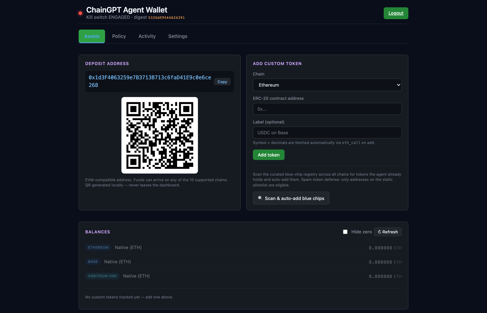
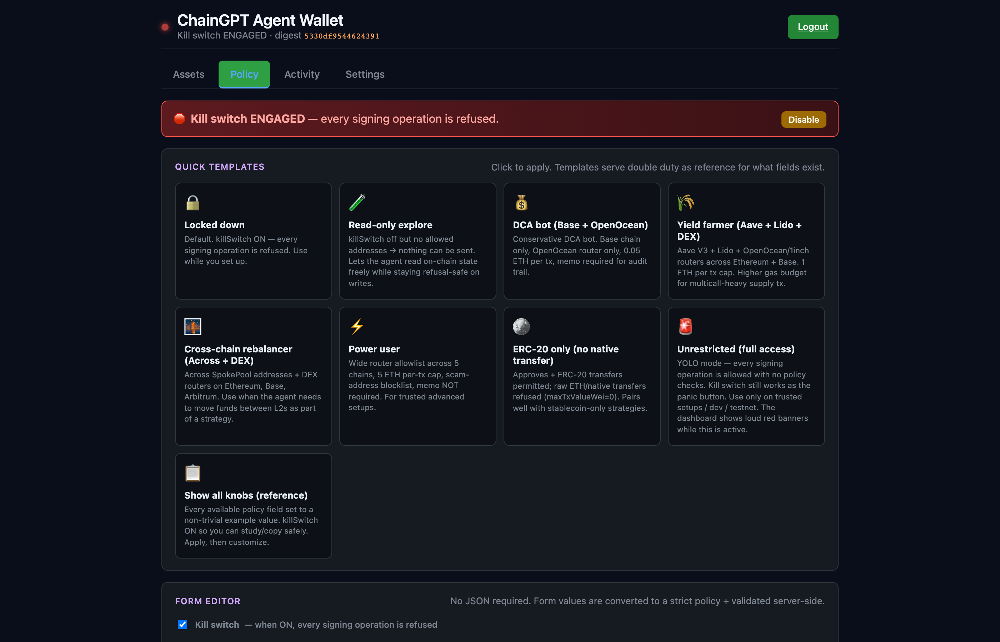
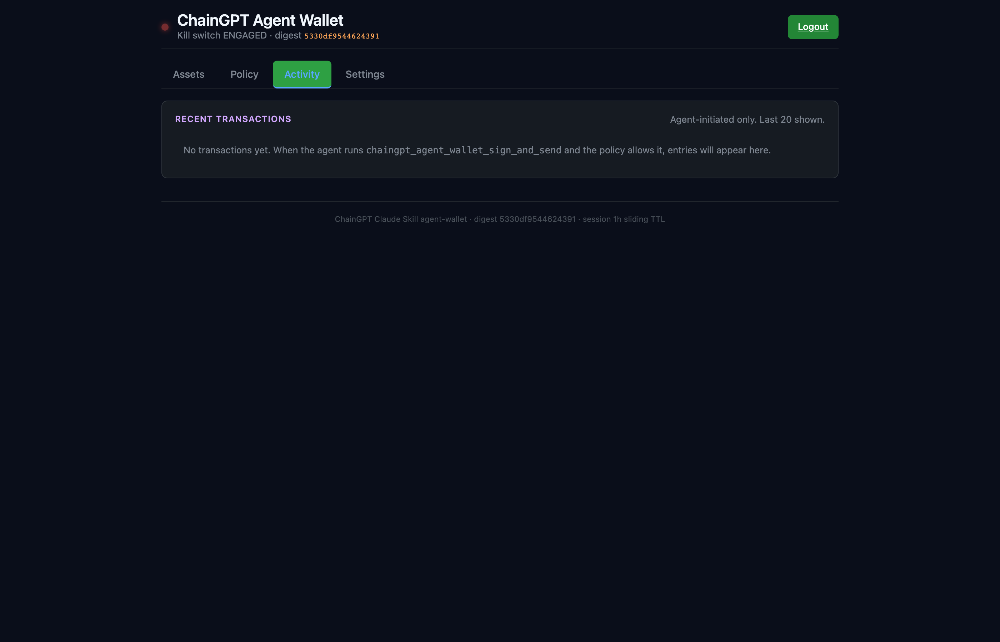
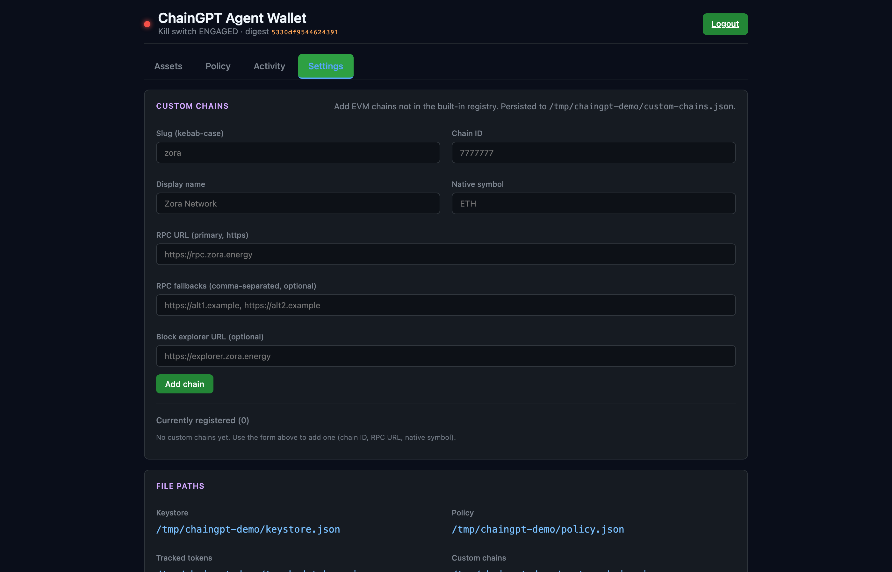

<div align="center">


# ChainGPT Developer Kit for Claude Code

**Turn your AI assistant into a Web3 engineering co‑pilot.**

One install gives Claude Code 111 MCP tools across **ChainGPT AI products** (chat, NFT, contract gen, audit, news), **EVM + Solana DEX trading** (OpenOcean, 1inch v6, CoW, Jupiter), **DeFi** (Aave V3, Lido, EigenLayer, Pendle, Morpho), **perps** (Hyperliquid + Drift), **prediction markets** (Polymarket), **cross‑chain bridging** (Across), **multi‑protocol portfolio**, **strategy plan persistence + backtest**, and an **agent wallet with localhost admin dashboard + prompt‑injection‑resistant policy gate**. Custody‑free. 45+ audited Solidity patterns. 10 project templates. Daily live‑API smoke CI.

[](https://github.com/ChainGPT-org/chaingpt-claude-skill/releases)
[](LICENSE)
[](#-testing)
[](#-mcp-server--111-tools)
[](https://code.claude.com)
[](https://www.typescriptlang.org/)
[](CONTRIBUTING.md)

[Quickstart](#-quickstart) · [Why this exists](#-why-this-exists) · [How it works](#-how-it-works) · [Security model](#-security-model) · [MCP tools](#-mcp-server--111-tools) · [Agent Wallet](#-the-agent-wallet-dashboard) · [vs alternatives](#-how-this-compares) · [Docs](https://docs.chaingpt.org/dev-docs-b2b-saas-api-and-sdk)

</div>

---

<br/>

## ⚡ Quickstart

**Two commands inside Claude Code:**

```
/plugin marketplace add ChainGPT-org/chaingpt-claude-skill
/plugin install chaingpt@chaingpt-claude-skill
```

The first line registers this repo as a custom plugin marketplace (Claude Code reads `.claude-plugin/marketplace.json` from the repo root). The second installs the `chaingpt` plugin from it — all 16 sub‑skills + the MCP server + reference docs + templates + Solidity patterns.

Then drop your API key in your shell **before** starting Claude Code:

```bash
export CHAINGPT_API_KEY="your-key-here"   # https://app.chaingpt.org
```

Now ask Claude Code anything — *"swap 0.1 ETH for USDC on Base with a risk check first"*, *"generate, audit, and deploy an ERC‑4626 vault on Arbitrum"*, *"what's my Aave health factor"*, *"show me Hyperliquid funding rates sorted by absolute value"*. The skill takes it from there.

> [!NOTE]
> `/plugin install <owner/repo>` (single‑step) only works for plugins published to Anthropic's curated marketplace. The two‑step custom‑marketplace flow above works **today**, no approval required.

<details>
<summary><b>Manual install (git clone)</b></summary>

If you'd rather pin a specific commit or work from a fork:

```bash
# User-level (recommended — applies to every project)
git clone https://github.com/ChainGPT-org/chaingpt-claude-skill ~/.claude/plugins/chaingpt

# Or project-level
git clone https://github.com/ChainGPT-org/chaingpt-claude-skill .claude/plugins/chaingpt
```

Build the MCP server:

```bash
cd ~/.claude/plugins/chaingpt/mcp-server
npm install && npm run build
```

The plugin's `.claude-plugin/plugin.json` and `.mcp.json` are picked up automatically when Claude Code finds the directory under `~/.claude/plugins/` or `.claude/plugins/`. Set the env var and restart Claude Code:

```bash
export CHAINGPT_API_KEY="your-key-here"
```

</details>

<details>
<summary><b>MCP server only (skip the skills layer)</b></summary>

If you want only the MCP tools — no auto‑loaded skills or reference docs — add the server directly to your Claude Code settings:

```json
{
  "mcpServers": {
    "chaingpt": {
      "command": "node",
      "args": ["/absolute/path/to/chaingpt-claude-skill/mcp-server/dist/index.js"],
      "env": { "CHAINGPT_API_KEY": "your-key-here" }
    }
  }
}
```

You lose the intent‑routing sub‑skills, reference docs, templates, and patterns this way. Recommended only if you're integrating the MCP server into a non‑Claude‑Code host.

</details>

<br/>

## 🎯 Why this exists

Building with Web3 AI APIs means juggling **seven different domains in one task**: an API surface (ChainGPT), DEX aggregators (OpenOcean / 1inch / CoW / Jupiter), risk scanners (GoPlus / Honeypot), on‑chain readers (Etherscan / Moralis / RPC), DeFi protocols (Aave / Lido / Pendle / Morpho), exchanges (Hyperliquid / Drift / Polymarket), cross‑chain bridges (Across), and the wallet signing that ties them together. Each has its own SDK, schema, error format, key management story, and rate‑limit gotchas. Most of an LLM's time is spent *guessing* parameters and burning credits on bad calls.

**This skill collapses all of that into one toolkit Claude already knows.** You describe the goal — *"swap 5 ETH on Arbitrum but only if GoPlus says the buy token is safe"* — and Claude orchestrates the seven calls, returns the unsigned transaction, and waits for you to sign in your wallet of choice. No SDK installs. No private‑key handoff. No "wait, which version of the OpenOcean API uses `gmxV2`?" archaeology.

### Who it's for

| Role | What you get from this |
|---|---|
| **Solo Web3 dev** | Skip the "30 SDKs, 3 docs sites, 12 schema versions" tax. Build a deploy pipeline, an MEV‑protected swap, or a portfolio dashboard from chat. |
| **DeFi power user** | Health‑factor monitor + automated stake/unstake + cross‑chain rebalance, all custody‑free, no on‑chain bot infrastructure required. |
| **Hackathon team** | The `chaingpt-hackathon` skill scaffolds a working 5‑file Web3 + AI project in 60 seconds. 10 templates including multi‑product compositions (NFT Marketplace, DeFi Dashboard). |
| **Quant / desk** | Hyperliquid + Drift + Polymarket live data, Pendle yield discovery, Morpho vault analytics, strategy plan persistence + grid backtester, all from one toolkit. |
| **Smart‑contract engineer** | 45+ audited Solidity patterns Claude composes from. Mainnet deploy with mandatory audit gate. Verification via Etherscan v2 across every major EVM chain. |
| **Agent builder** | The agent gets its own EOA + policy file the LLM cannot bypass. Localhost admin dashboard with 9 policy templates + kill switch. Build "bounded autonomous" trading/yield bots safely. |

<br/>

## 🧠 How it works

Four cooperating layers. Each does one thing well. Claude routes between them automatically.

```
┌────────────────────────────────────────────────────────────────────────┐
│                              Claude Code                               │
└───────────────────────────────┬────────────────────────────────────────┘
                                │
        ┌───────────────────────┼───────────────────────┐
        ▼                       ▼                       ▼
┌──────────────────┐  ┌──────────────────┐  ┌──────────────────────┐
│  16 sub-skills   │  │ Reference docs   │  │ Templates + Patterns │
│  (intent → tool) │  │ (19 markdown)    │  │ (11 + 45)            │
│  Triggers route  │  │ Every endpoint   │  │ Production scaffolds │
│  Claude to the   │  │ + param + cost   │  │ + audited Solidity   │
│  right toolkit   │  │ + error code     │  │                      │
└────────┬─────────┘  └──────────────────┘  └──────────────────────┘
         │
         ▼
┌────────────────────────────────────────────────────────────────────────┐
│  MCP Server — 111 tools (the runtime)                                  │
│                                                                        │
│  ChainGPT AI       │  Web3 toolkit    │  Mainnet execution             │
│  • chat / NFT      │  • wallet scan   │  • EVM swap (OO/1inch/CoW)    │
│  • generator       │  • token research│  • Solana swap (Jupiter)      │
│  • auditor         │  • risk scan     │  • deploy + verify            │
│  • news            │  • on-chain read │  • Aave/Lido/EigenLayer       │
│                    │  • AI-enriched   │  • Hyperliquid + Drift        │
│  Agent wallet      │    intel         │  • Polymarket data            │
│  • encrypted EOA   │                  │  • Across bridge              │
│  • policy gate     │                  │  • Pendle + Morpho yield      │
│  • admin dashboard │                  │  • portfolio fan-out          │
│                    │                  │  • strategy plans + backtest  │
└────────────────┬───────────────────────┬──────────────────────────────┘
                 │                       │
                 ▼                       ▼
        ┌─────────────────┐     ┌─────────────────────────┐
        │  Mock Server    │     │  Real upstreams         │
        │  localhost:3001 │     │  (DexScreener, GoPlus,  │
        │  Zero credits   │     │   OpenOcean, Aave,      │
        │  for dev / CI   │     │   Hyperliquid, …)       │
        └─────────────────┘     └─────────────────────────┘
```

**The four layers:**

1. **Sub‑skills** (`skills/*/SKILL.md`, 16 of them) — markdown files with YAML frontmatter that Claude Code auto‑routes based on intent. Examples: `chaingpt-deploy` triggers on "deploy a contract"; `chaingpt-trade` on "swap"; `chaingpt-agent-wallet` on "give the agent a wallet." Each sub‑skill bundles the relevant tools, mandatory pre‑flight checks, and links to deeper reference docs.

2. **Reference docs** (`reference/*.md`, 19 files) — every endpoint, parameter, response shape, credit cost, and error code for the seven ChainGPT products. The skill loads these into Claude's context on demand so it never has to guess a parameter name.

3. **Templates + Patterns** (`templates/` + `patterns/`, 10 templates + 45+ Solidity patterns) — production‑ready scaffolds (Next.js chatbot, NFT marketplace, DeFi dashboard, React Native wallet, Nuxt news app, …) and audited Solidity (ERC‑20 variants, ERC‑4626 vaults, UUPS upgradeable, Governor, role‑based access, timelocks, …). Claude composes from these instead of regenerating boilerplate from scratch.

4. **MCP Server** (`mcp-server/`, 111 tools) — the runtime. A `@modelcontextprotocol/sdk` server that exposes every state‑changing capability as an MCP tool. Direct API calls, on‑chain reads via public RPC, custody‑free transaction building. Claude doesn't *write code that calls* APIs — Claude calls them directly through the MCP layer.

**Plus a mock server** (`mock-server/`) — a full drop‑in replacement for the ChainGPT API at `http://localhost:3001`. Realistic responses, simulated latency, credit tracking. Build and CI without burning a single credit.

<br/>

## 🔐 Security model

The single design choice that everything else follows from: **the plugin never sees a private key for funds the user controls.** Every state‑changing tool builds an unsigned transaction (EVM) or signed EIP‑712 intent (Hyperliquid / Polymarket) and hands it back. You sign in whatever wallet you already trust — MetaMask, Rabby, Trust, Phantom, hardware wallet (Ledger / Trezor via the same flow), WalletConnect, or your own custom signer.

| Threat | Defense |
|---|---|
| **Drained funds** via prompt‑injected "send everything to attacker" | The plugin doesn't hold keys for user wallets. The agent wallet (a separate optional feature) has an admin policy gate in code (not in the LLM prompt) that refuses out‑of‑policy txs even under successful prompt injection. |
| **Accidental mainnet broadcast** | Every state‑changing mainnet tool refuses without `acknowledgeMainnet: true`. The refusal message lists exactly what to verify. |
| **Unaudited deploy** | `chaingpt_deploy_build_tx` requires a prior `chaingpt_audit_contract` pass on mainnet. The `chaingpt-deploy` skill enforces the audit step. |
| **Honeypot / rug / sanctioned address** | `chaingpt_risk_token` + `chaingpt_risk_honeypot` + `chaingpt_risk_address` integrate GoPlus + Honeypot.is. The `chaingpt-trade` skill makes risk check mandatory before any `build_swap_tx`. |
| **Leaked API key in source** | `CHAINGPT_API_KEY` lives in env only. Daemon paths refuse to start if the env var is missing. CI fails on literal API‑key patterns in source. |
| **Tx replay across chains** | Every signed payload includes chainId or equivalent (EIP‑712 domain on EVM; chain‑specific addresses on Solana; HL's L1 source byte; Polymarket's CTF domain). |

The **agent wallet** is the one place the plugin can hold a key — but only the *agent's own* key, encrypted with a passphrase the agent never sees, gated by a policy file the agent has no tool to write. See [the dashboard section](#-the-agent-wallet-dashboard) for the full threat model and admin flow.

<br/>

## 🖥️ The Agent Wallet Dashboard

Ships with a real localhost wallet UI for the AI agent — not just a CLI. Encrypted EOA keystore, admin‑controlled policy gate the agent **cannot bypass** even under prompt injection, kill switch, 9 policy templates including 🚨 unrestricted mode, custom EVM chain registration, blue‑chip auto‑scan.

<p align="center">
  <a href="docs/screenshots/agent-wallet-dashboard.png">
    
  </a>
</p>

<p align="center">
  <a href="docs/screenshots/agent-wallet-policy.png"></a>
  <a href="docs/screenshots/agent-wallet-activity.png"></a>
  <a href="docs/screenshots/agent-wallet-settings.png"></a>
</p>

**Launch it locally in 30 seconds:**

```bash
# 1. Set a strong passphrase (>=16 chars) for the encrypted keystore
export CHAINGPT_AGENT_WALLET_PASSPHRASE="your-strong-passphrase-here-min-16-chars"

# 2. Try the dashboard without touching your real ~/.chaingpt-mcp/ files
node scripts/demo-agent-wallet-dashboard.mjs
```

Open **`http://127.0.0.1:8787/`**. The console prints a one‑time admin token — paste it at the login screen.

**Why this is prompt‑injection‑resistant:**

1. Policy lives in a JSON file (`~/.chaingpt-mcp/agent-wallet/policy.json`). **No MCP tool can write it** — admin edits via the localhost dashboard or a text editor.
2. Every `sign_and_send` call loads the policy file fresh and runs `checkPolicy(intent)` — pure deterministic code that doesn't see the LLM's context. Refuses if any rule fails (kill switch, chain whitelist, address allow/blocklist, value cap, gas cap, selector blocklist, memo requirement).
3. The LLM has no MCP tool that issues arbitrary HTTP requests, so it cannot reach the localhost dashboard's edit endpoints either.
4. Default policy is **fail‑closed** (`killSwitch: true`). Admin must explicitly opt in.

**Security:** bound to `127.0.0.1` only — never `0.0.0.0`. Origin + Referer check on every POST. Session cookie HttpOnly + SameSite=Strict + 1h sliding TTL. Admin token rotated on every restart. Atomic write + `.bak` backup at 0600.

<br/>

## 🔌 MCP Server — 111 Tools

The MCP server gives Claude **direct API and on‑chain access** — not just code generation. 111 tools across 11 categories. Detailed sections follow.

| Category | Tools | Notes |
|---|---:|---|
| ChainGPT AI products (chat / NFT / audit / generator / news) | 18 | Core ChainGPT API surface |
| Web3 toolkit (wallet / research / risk / on‑chain) | 14 | 11 chains incl. Solana |
| AI‑enriched composed tools | 2 | DexScreener + GoPlus + ChainGPT news + AI signal in one call |
| Mainnet contract deployment | 5 | Custody‑free, mandatory audit gate |
| Mainnet DEX trading (OpenOcean + 1inch + CoW + Jupiter) | 9 | Custody‑free |
| Mainnet DeFi (Aave / Lido / EigenLayer / Pendle / Morpho) | 12 | Custody‑free, health‑factor gate |
| Perps (Hyperliquid + Drift) | 14 | Read‑only on Drift; HL signed EIP‑712 actions |
| Polymarket prediction markets | 6 | Read + signed CTF/Neg‑Risk orders |
| Cross‑chain bridge (Across v3) | 3 | 10 EVM mainnets |
| Solana lending (Marginfi + Kamino) | 4 | Read‑only |
| **Solana signing foundation + SPL transfer** | 2 | Custody‑free `VersionedTransaction`, classic + Token‑2022 |
| **ERC‑4337 v0.7 account‑abstraction foundation** | 4 | userOpHash, pack, bundler‑RPC proxy |
| Multi‑protocol portfolio + strategy plans + backtest | 6 + 1 | One‑shot snapshot across 4 protocols |
| Agent wallet (encrypted EOA + admin policy gate) | 7 | LLM cannot bypass policy |
| Utility (credit estimate, balance) | 2 | |
| **Total** | **111** | |

### ChainGPT AI products (18 tools)

| Tool | What it does |
|---|---|
| `chaingpt_chat` | Ask the Web3 AI chatbot — crypto‑native LLM with live on‑chain data |
| `chaingpt_chat_with_context` | Branded chatbot with company / token context injection |
| `chaingpt_chat_history` | Retrieve past conversations by session id |
| `chaingpt_nft_generate_image` · `_enhance_prompt` · `_generate_and_mint` · `_get_chains` | Generate AI art, mint on 22+ chains |
| `chaingpt_audit_contract` | AI security audit with scored report |
| `chaingpt_generate_contract` | Natural language → production Solidity |
| `chaingpt_news_fetch` · `chaingpt_news_categories` | Crypto news with category + token filters |
| `chaingpt_estimate_credits` · `chaingpt_check_balance` | Cost + balance utilities |

### Web3 toolkit (14 tools)

Across **11 chains**: ethereum, base, arbitrum, optimism, polygon, bsc, avalanche, blast, linea, scroll, solana.

| Tool | What it does | Backend |
|---|---|---|
| `chaingpt_wallet_balances` · `_positions` · `_pnl` | Multi‑chain native + ERC‑20 balances, DeFi positions, realized + unrealized P&L | Moralis (opt) + RPC |
| `chaingpt_research_token` · `_pairs` · `_trending` | Price, liquidity, volume, all trading pairs, trending tokens | DexScreener |
| `chaingpt_risk_token` · `_honeypot` · `_address` · `_contract_source` | Honeypot / mintable / proxy flags, buy + sell simulation, sanctions / phishing check, verified source code | GoPlus + Honeypot + Etherscan v2 |
| `chaingpt_onchain_tx` · `_address` · `_gas` · `_block` | Decode any tx, recent activity, multi‑chain gas oracle, block info | Etherscan v2 + RPC |

### AI‑enriched composed tools

These are the strategic differentiator — pure aggregation tools wrapped in ChainGPT's AI layer.

| Tool | What it does |
|---|---|
| `chaingpt_intel_token` | One call → DexScreener + GoPlus + ChainGPT news + AI signal. The "research this token" tool. ~1 credit. |
| `chaingpt_intel_wallet` | Portfolio + per‑holding risk rating across chains. Free read. |

### Mainnet contract deployment (5 tools)

Custody‑free. The plugin builds an unsigned tx; the user signs externally. MAINNET is the default; testnet is opt‑in via the `network` parameter.

| Tool | What it does |
|---|---|
| `chaingpt_deploy_compile` | Solidity 0.8.x → bytecode + ABI + warnings |
| `chaingpt_deploy_estimate` | Preview gas cost on the target chain |
| `chaingpt_deploy_build_tx` | **Refuses mainnet without `acknowledgeMainnet: true`** |
| `chaingpt_deploy_verify` · `_verify_status` | Submit source to Etherscan v2; poll the GUID |

**Mainnets** (default): ethereum · base · arbitrum · optimism · polygon · bsc · avalanche · blast · linea · scroll.
**Testnets** (opt‑in): sepolia · base‑sepolia · arbitrum‑sepolia · optimism‑sepolia · polygon‑amoy · bsc‑testnet.

The `chaingpt-deploy` skill enforces the mandatory pipeline: **generate → audit → compile → estimate → confirm → build‑tx → user‑signs → verify**.

### Mainnet DEX trading (9 tools)

Custody‑free. Same `acknowledgeMainnet` safety pattern.

| Tool | Backend |
|---|---|
| `chaingpt_dex_quote` · `_build_swap_tx` · `_approve_tx` | OpenOcean v4 (EVM) |
| `chaingpt_dex_jupiter_quote` · `_jupiter_build_swap_tx` | Jupiter v6 (Solana) |
| `chaingpt_dex_1inch_quote` · `_1inch_build_swap_tx` | 1inch v6 (EVM, key‑gated) |
| `chaingpt_dex_cow_quote` · `_cow_create_order` | CoW Protocol (EVM, intent‑based, MEV‑protected) |

The `chaingpt-trade` skill codifies the mandatory pre‑flight: **`chaingpt_risk_token` on the buy token + `chaingpt_dex_quote` BEFORE any `build_swap_tx`**.

### Mainnet DeFi protocols (12 tools)

Custody‑free. `chaingpt-defi` skill enforces a `chaingpt_defi_aave_health` check before any borrow / withdraw.

| Tool | What it does |
|---|---|
| `chaingpt_defi_aave_health` · `_supply_tx` · `_borrow_tx` · `_repay_tx` · `_withdraw_tx` | Aave V3 on 7 chains |
| `chaingpt_defi_lido_stake_tx` | Stake native ETH → stETH on Lido |
| `chaingpt_defi_eigenlayer_deposit_tx` | Restake stETH / rETH / cbETH on EigenLayer |
| `chaingpt_defi_pendle_markets` · `_market` | Pendle yield‑strip discovery — fixed APY, implied APY, YT, maturity |
| `chaingpt_defi_morpho_markets` · `_vaults` · `_user` | Morpho Blue isolated markets + MetaMorpho curated vaults |

Aave V3 chains: ethereum, base, arbitrum, optimism, polygon, bsc, avalanche.

### Perps — Hyperliquid + Drift (14 tools)

Live mainnet data. Hyperliquid supports **signed EIP‑712 L1 actions** (custody‑free order placement). Drift is read‑only in this release.

| Tool | What it does |
|---|---|
| `chaingpt_hl_markets` · `_mids` · `_orderbook` · `_account` · `_fills` · `_funding` | Read HL market data + account state |
| `chaingpt_hl_place_order_payload` · `_cancel_order_payload` · `_update_leverage_payload` | EIP‑712 signed intents — user wallet finalizes |
| `chaingpt_drift_markets` · `_market` · `_orderbook` · `_funding` · `_user` | Read Drift perp markets, orderbook, funding, user account |

### Polymarket prediction markets (6 tools)

| Tool | What it does |
|---|---|
| `chaingpt_pm_markets` · `_market` · `_orderbook` · `_trades` | Discover markets + read live data |
| `chaingpt_pm_create_order` · `_create_neg_risk_order` | EIP‑712 signed CTF / Neg‑Risk order intents |

### Cross‑chain bridging (3 tools)

| Tool | What it does |
|---|---|
| `chaingpt_bridge_quote` · `_build_deposit_tx` · `_status` | Across Protocol v3 across 10 EVM mainnets |

### Solana lending (4 tools, read‑only)

| Tool | What it does |
|---|---|
| `chaingpt_defi_marginfi_banks` · `_account` | Marginfi v2 banks + user account |
| `chaingpt_defi_kamino_markets` · `_vaults` | Kamino markets + automated yield vaults |

### Portfolio + strategy plans + backtest (7 tools)

| Tool | What it does |
|---|---|
| `chaingpt_portfolio_snapshot` | Fan‑out parallel to HL + PM + Morpho + Drift for one user |
| `chaingpt_strategy_dca` · `_grid` · `_funding_arb` · `_copy_trade` | Strategy template planners |
| `chaingpt_strategy_save_plan` · `_load_plan` · `_list_plans` · `_delete_plan` | Persist strategy plans to `~/.chaingpt-mcp/plans/` |
| `chaingpt_backtest_grid` | Replay a buy/sell ladder against historical CoinGecko prices; reports realized P&L from grid spreads vs buy‑and‑hold |

### Agent wallet (7 tools)

See [the dashboard section](#-the-agent-wallet-dashboard) for the threat model and admin flow.

| Tool | What it does |
|---|---|
| `chaingpt_agent_wallet_init` | AES‑256‑GCM encrypted keystore, scrypt KDF |
| `chaingpt_agent_wallet_address` · `_status` · `_balances` · `_policy` | Read‑only views |
| `chaingpt_agent_wallet_sign_and_send` | **Only fund‑moving tool.** Policy gate runs deterministically; refuses with reason on any violation. |
| `chaingpt_agent_wallet_serve_ui` | Start the localhost admin dashboard on 127.0.0.1:8787 |

### Optional API keys

The plugin works without these but unlocks more if present:

| Env var | Unlocks | Get one |
|---|---|---|
| `MORALIS_API_KEY` | Full multi‑chain ERC‑20 scan + DeFi positions + P&L | https://moralis.io (25k req/month free) |
| `ETHERSCAN_API_KEY` | Higher Etherscan rate limit (Etherscan v2 covers every major EVM chain) | https://etherscan.io/myapikey (free) |
| `ONEINCH_API_KEY` | 1inch v6 aggregator routing | https://portal.1inch.dev |

<br/>

## 📦 ChainGPT products covered

| Product | What it does | Cost |
|---|---|---|
| **Web3 AI Chatbot & LLM** | Crypto‑native LLM with live on‑chain data, Nansen Smart Money, 33+ chains | 0.5 credits |
| **AI NFT Generator** | Text‑to‑image + on‑chain minting across 22+ chains, 4 AI models | 1–14.25 credits |
| **Smart Contract Generator** | Natural language → production Solidity | 1 credit |
| **Smart Contract Auditor** | AI vulnerability detection with scored audit reports | 1 credit |
| **AI Crypto News** | Real‑time AI‑curated news, 24 categories, RSS feeds | 0.1 credits |
| **AgenticOS** | Open‑source autonomous X/Twitter AI agents | 1 credit/tweet |
| **Solidity LLM** | Open‑source 2B‑param model for Solidity code generation | Free |

Plus **SaaS & Whitelabel** references — Launchpad, Staking, Vesting, Telegram bots.

**1 credit = $0.01 USD · 15% bonus when paying with $CGPT.**

<br/>

## 📋 10 Project Templates

| Template | Stack | ChainGPT products |
|---|---|---|
| Web3 AI Chatbot | Express + TypeScript | LLM |
| NFT Minting Service | Node.js | NFT Generator |
| Contract Audit CI/CD | GitHub Actions | Auditor |
| Crypto News Dashboard | Vanilla JS | News API |
| AI Twitter Agent | Node.js | AgenticOS |
| **NFT Marketplace** | Next.js + wagmi | NFT + LLM + Auditor + News |
| **DeFi Dashboard** | React + Recharts | LLM + News + Auditor |
| **Next.js Chatbot** | Next.js 14 App Router | LLM |
| **React Native Wallet** | Expo + React Native | LLM + NFT |
| **Nuxt News App** | Nuxt 3 SSR | News API |

<br/>

## 🔐 45+ Smart Contract Patterns

Audited, production‑ready Solidity patterns Claude composes from instead of generating from scratch:

| Category | Count | Examples |
|---|---:|---|
| **ERC‑20 Tokens** | 10 | Basic, burnable, taxable, reflection, governance, multi‑chain |
| **NFTs** | 10 | ERC‑721, 721A, lazy mint, soulbound, dynamic, ERC‑1155, revenue‑sharing |
| **DeFi** | 10 | Staking, vesting, bonding curve, AMM, flash loans, ERC‑4626 vault |
| **Governance** | 5 | Governor, multi‑sig, DAO treasury, delegation |
| **Security** | 10 | Access control, upgradeable (UUPS), timelock, escrow, EIP‑712 |

<br/>

## 💬 Usage examples

Just talk to Claude naturally:

```
"Build me a Web3 AI chatbot with streaming responses"
"Generate and mint an NFT on Base using ChainGPT"
"Set up smart contract auditing in my CI/CD pipeline"
"Scaffold an NFT marketplace that uses 4 ChainGPT products"
"What's the credit cost for generating 100 NFTs with NebulaForge XL?"
"Write a staking contract"   →  uses patterns library, not from scratch
"I'm migrating from OpenAI — help me switch to ChainGPT"
"I'm at a hackathon — scaffold me a DeFi project fast"
```

End‑to‑end DeFi flow:

```
You: "I want to long ETH 5x on Hyperliquid but check the funding rate first.
      If funding is paying shorts, post a limit order at -1.5% from mid."

Claude: → chaingpt_hl_markets
        → chaingpt_hl_funding  (ETH 8h funding rate: -0.0042% → shorts pay longs ✓)
        → chaingpt_hl_orderbook(symbol=ETH, depth=20)  (mid: 4218.5)
        → chaingpt_hl_place_order_payload(symbol=ETH, side=buy, size=5000,
                                          price=4155.2, leverage=5,
                                          tif=Gtc)
        ✓ EIP-712 intent ready. Paste this into your HL signer to broadcast:
        { "action": {...}, "nonce": ..., "signature": "0x..." }
```

Custody‑free deploy:

```
You: "Generate an ERC-4626 vault for a yield strategy on Arbitrum,
      audit it, then prepare a mainnet deploy. Don't broadcast."

Claude: → chaingpt_generate_contract(...)
        → chaingpt_audit_contract(...)  (score: 9.2/10 — no critical issues)
        → chaingpt_deploy_compile(...)  (bytecode: 0x60806040..., ABI: [...])
        → chaingpt_deploy_estimate(network=arbitrum)  (estimated cost: 0.018 ETH)
        → chaingpt_deploy_build_tx(network=arbitrum, acknowledgeMainnet=true)
        ✓ Unsigned tx ready. Open MetaMask / Rabby / Ledger and broadcast.
        After confirmation, run:
          chaingpt_deploy_verify(address=…, network=arbitrum)
```

<br/>

## 💰 Pricing & credits

| Item | Price |
|---|---|
| **1 credit** | $0.01 USD |
| **Pay with $CGPT** | 15% bonus credits |
| **Mock server** | Free, unlimited (`http://localhost:3001`) |
| **Live‑smoke CI daily run** | Free (uses public endpoints; ChainGPT‑side calls use a smoke key) |
| **Web3 AI Grant** | Up to **$1,000,000** for projects built on ChainGPT — [grant page](https://www.chaingpt.org/web3-ai-grant) |
| **Pad Innovation Grant** | Up to **$25,000** for hackathon / pilot projects — [grant page](https://docs.chaingpt.org/dev-docs-b2b-saas-api-and-sdk/chaingpt-pad-innovation-grant-program) |

Per‑product credit costs are in [reference/pricing.md](reference/pricing.md) and `chaingpt_estimate_credits` returns a quote before you spend.

<br/>

## 🧪 Testing

> **Use the mock server to develop and test without spending a single credit.**

The mock server is a full drop‑in replacement for the ChainGPT API — realistic responses, simulated latency, credit tracking — so you can build, iterate, and run CI/CD pipelines without touching your API quota.

```bash
cd .claude/skills/chaingpt/mock-server
npm install && npm run dev
# → http://localhost:3001
```

Point your `CHAINGPT_BASE_URL` at `http://localhost:3001` and everything works exactly as it would in production. **No API key required.**

### Run the full test suite

```bash
./scripts/test-all.sh           # everything (offline + live smoke, ~50s)
./scripts/test-all.sh --fast    # everything except live smoke (~20s)
./scripts/test-all.sh --only mcp-test    # one layer only
```

The orchestrator runs **six layers** — see [`TESTING.md`](TESTING.md) for the full reference.

| Layer | Pass count | Network |
|---|---|---|
| `validate` (structural / frontmatter checks) | 159 | none |
| `typecheck` (`tsc --noEmit` for both servers) | clean | none |
| `mcp-test` (vitest — handlers, policy gate, signing, schemas) | **250** | none |
| `mock-test` (vitest — mock‑server endpoints via supertest) | 26 | none |
| `examples` (`node --check` + `python3 -m ast`) | every file | none |
| `smoke` (live mainnet APIs) | 39 | yes |

CI runs the first four on every push and PR ([`.github/workflows/ci.yml`](.github/workflows/ci.yml)). Smoke runs daily plus on‑demand and opens a labeled GitHub issue on scheduled‑run failure.

**The contract: every PR that adds a tool or behavior must add tests in the same PR.** See [`TESTING.md`](TESTING.md#adding-tests-for-a-new-capability).

<br/>

## 📊 How this compares

There are several Web3 + AI agent toolkits in flight. They aim at the same outcome (let an LLM call Web3 surfaces) but pick different trade‑offs.

| | **This skill** | Goat SDK (Crossmint) | Coinbase AgentKit | MetaMask Snaps + MCP | Heurist |
|---|---|---|---|---|---|
| **Surface** | 111 MCP tools across 11 categories incl. perps + prediction markets + cross‑chain + agent wallet | Plugin per protocol (extensible) | EVM swap + on‑chain + Base‑native | Wallet + LLM bridge | Image gen + LLM marketplace |
| **Custody model** | User‑sovereign default + bounded agent EOA with admin policy gate | User‑sovereign | User wallet (CDP) or smart wallet | MetaMask signs everything | N/A (no signing) |
| **Mainnet safety** | Mandatory `acknowledgeMainnet: true` + audit‑before‑deploy gate | Per‑plugin | Default mainnet | MetaMask UI confirmation | N/A |
| **AI enrichment** | DexScreener + GoPlus + News + AI signal composed into one call | None native | None native | None native | Image + LLM only |
| **Cost transparency** | Per‑tool credit costs surfaced; mock server free | LLM tokens only | Gas only | Gas only | Per‑model |
| **Solidity codegen + audit** | Native (`chaingpt_generate_contract` + `chaingpt_audit_contract`) | No | No | No | No |
| **Prediction markets** | Polymarket native | No | No | No | No |
| **Perps** | Hyperliquid (signed) + Drift (read) | Add‑on | No | No | No |
| **Test harness** | 6 layers + daily live smoke | Per‑plugin | Examples only | Snap testing | None |
| **License** | MIT | MIT | Apache‑2 | MIT | Various |

**Where this wins:** breadth (111 tools), AI‑enriched composed tools (the DexScreener + GoPlus + News + AI signal combo), mainnet safety guard rails, and the agent‑wallet admin dashboard.

**Where Goat / AgentKit win:** if you want pluggable per‑protocol extensions over a fixed core surface, Goat's plugin model is cleaner. If you're Coinbase‑native (CDP, Base, Smart Wallet end‑to‑end), AgentKit is the obvious choice.

These aren't mutually exclusive — you can run this skill alongside any of them in Claude Code.

<br/>

## 🗂️ Project structure

<details>
<summary><b>Click to expand</b></summary>

```
chaingpt-claude-skill/
├── .claude-plugin/
│   └── plugin.json                   # Plugin manifest (name, version, author)
├── .mcp.json                         # MCP server configuration
├── VERSION                           # Semantic version
├── README.md                         # This file
├── CONTRIBUTING.md
├── CHANGELOG.md
├── TESTING.md                        # Testing guide — six-layer harness
├── LICENSE
│
├── skills/                           # 16 sub-skills (auto-discovered)
│   ├── chaingpt/SKILL.md             #   Main skill — API reference + tool routing
│   ├── agent-wallet/SKILL.md         #   AI's own EOA with admin policy gate
│   ├── bridge/SKILL.md               #   Across cross-chain
│   ├── debug/SKILL.md                #   Troubleshoot API errors
│   ├── defi/SKILL.md                 #   Aave + Lido + EigenLayer + Pendle + Morpho
│   ├── deploy/SKILL.md               #   Mainnet contract deployment
│   ├── drift/SKILL.md                #   Drift perps on Solana (read-only)
│   ├── hackathon/SKILL.md            #   60-second project scaffolder
│   ├── hyperliquid/SKILL.md          #   Hyperliquid perps
│   ├── playground/SKILL.md           #   Interactive API testing
│   ├── polymarket/SKILL.md           #   Polymarket prediction markets
│   ├── research/SKILL.md             #   Token research + DexScreener
│   ├── security/SKILL.md             #   Honeypot + risk + audit
│   ├── strategy/SKILL.md             #   Plan persistence + backtest
│   ├── trade/SKILL.md                #   OpenOcean / 1inch / CoW / Jupiter
│   └── update/SKILL.md               #   Check for skill updates
│
├── reference/                        # API & SDK documentation (19 files)
├── templates/                        # 10 project templates (+ composition guide)
├── patterns/                         # 45+ Solidity patterns (6 files)
├── migration/                        # Platform migration guides (3 files)
├── mcp-server/                       # MCP server — 111 tools, 250 vitest cases
├── mock-server/                      # Mock API for zero-credit dev — 26 tests
├── scripts/                          # validate.sh + test-all.sh + demo launcher
└── examples/                         # Working code — JS + Python
```

</details>

<br/>

## 🗺️ Roadmap

### Shipped (1.0 → 1.9)
- [x] Complete API reference for all 7 ChainGPT products
- [x] **111 MCP tools** across ChainGPT AI, EVM + Solana DEX (OpenOcean · 1inch v6 · CoW · Jupiter), DeFi (Aave · Lido · EigenLayer · Pendle · Morpho), perps (Hyperliquid · Drift), prediction markets (Polymarket), cross‑chain (Across), Solana lending (Marginfi · Kamino), multi‑protocol portfolio snapshot, strategy plan persistence + backtest
- [x] **Agent wallet** — encrypted keystore + prompt‑injection‑resistant admin policy gate + localhost admin dashboard (assets / policy / activity / settings tabs, kill switch, 9 policy templates including 🚨 unrestricted)
- [x] **Custody‑free signing** — every state‑changing tool returns an unsigned tx / EIP‑712 intent; the plugin never sees a private key. `acknowledgeMainnet: true` gate on every mainnet write
- [x] 10 project templates including multi‑product compositions
- [x] 45+ audited Solidity patterns
- [x] Mock server for zero‑credit development (26 endpoint tests)
- [x] **Unified test harness** — `./scripts/test-all.sh` runs six layers. 250 vitest + 26 mock + 159 validate + 39 live‑API cases
- [x] **Daily live‑API smoke CI** — catches upstream drift within 24h, opens a labeled GitHub issue on failure
- [x] Migration guides (OpenAI, Alchemy, custom)
- [x] Cost optimization & wallet integration docs
- [x] **ERC‑4337 v0.7 foundation** — userOpHash, PackedUserOperation packing, bundler‑RPC proxy. 4 MCP tools. Per‑provider session‑key issuance (Safe / Kernel / Biconomy / Alchemy SW) queued as follow‑ups.
- [x] **SSE streaming demo** — `examples/sse/` wraps the General Chat stream as Server‑Sent Events with a browser EventSource client.
- [x] **Multi‑language SDK examples (Go, Rust)** — `examples/go/` (stdlib only) + `examples/rust/` (reqwest blocking + serde + rustls) calling the public API gateway.

### In review (open PRs)
- [ ] **CI protective gates** (PR #29) — solidity pattern compilation, MCP boot smoke, version consistency. Adds two CI jobs; six → eight test layers.
- [ ] **Solana signing foundation** (PR #30) — custody‑free `VersionedTransaction` builder + native SOL + SPL transfer tools. +2 tools, +29 tests. Drift/Marginfi/Kamino signed actions queued as follow‑up PRs that layer on this.

### Next up
- [ ] **Drift / Marginfi / Kamino signed actions** — bring each from read‑only to signed execution on top of PR #30's Solana foundation
- [ ] **Per‑provider ERC‑4337 session‑key issuance** — Safe, Kernel (ZeroDev), Biconomy, Alchemy SW on top of the foundation already shipped
- [ ] Claude Code plugin marketplace listing
- [ ] Video tutorials & walkthroughs
- [ ] Community template submissions

<br/>

## 🤝 Contributing

Contributions are welcome! See [CONTRIBUTING.md](CONTRIBUTING.md) for guidelines.

```bash
# Validate your changes before submitting
bash scripts/validate.sh
```

<br/>

## 📄 Prerequisites

| Requirement | Link |
|---|---|
| **ChainGPT API Key** | [app.chaingpt.org](https://app.chaingpt.org) — connect a wallet to sign up |
| **API Credits** | [Buy credits](https://app.chaingpt.org/addcredits) — 1,000 credits = $10 |
| **Claude Code** | [code.claude.com](https://code.claude.com) |

<br/>

## 🔗 Links

<div align="center">

[Developer Docs](https://docs.chaingpt.org/dev-docs-b2b-saas-api-and-sdk) · [API Dashboard](https://app.chaingpt.org/apidashboard) · [Pricing](https://app.chaingpt.org/pricing) · [Web3 AI Grant ($1M)](https://www.chaingpt.org/web3-ai-grant) · [Pad Innovation Grant ($25K)](https://docs.chaingpt.org/dev-docs-b2b-saas-api-and-sdk/chaingpt-pad-innovation-grant-program)

[Solidity LLM on HuggingFace](https://huggingface.co/Chain-GPT/Solidity-LLM) · [AgenticOS on GitHub](https://github.com/ChainGPT-org/AgenticOS) · [Book a SaaS Demo](https://calendly.com/saaswl/demo)

</div>

<br/>

## 📜 License

MIT — see [LICENSE](LICENSE) for details.

---

<div align="center">

**Built by [ChainGPT](https://www.chaingpt.org)** — AI Infrastructure for Web3

If this skill saved you time, consider giving it a ⭐

</div>
